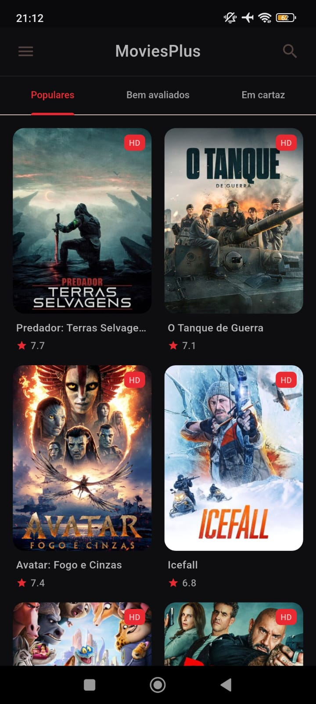
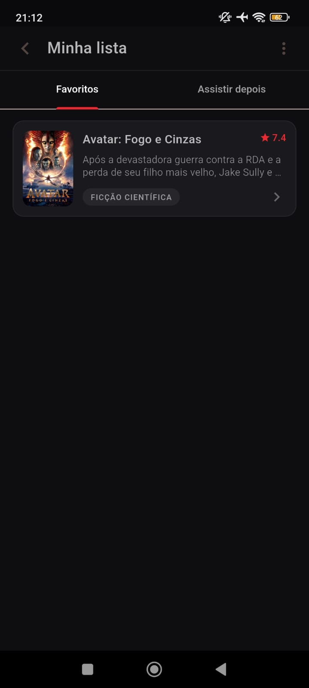
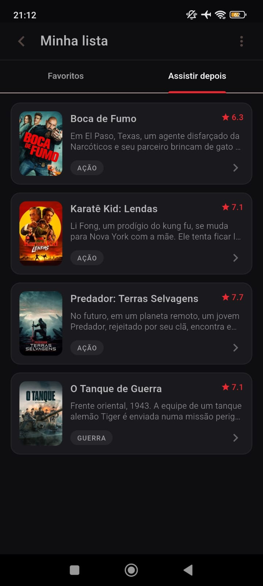

# MoviesPlus

App mobile feito em Flutter para explorar filmes usando a API do TMDB: listas (Populares, Bem avaliados, Em cartaz), detalhes do filme e ações como Favoritos e Assistir depois.

## Preview

<table>
  <tr>
    <td align="center"><b>Home</b></td>
    <td align="center"><b>Favoritos</b></td>
    <td align="center"><b>Assistir depois</b></td>
  </tr>
  <tr>
    <td></td>
    <td></td>
    <td></td>
  </tr>
</table>


## Funcionalidades
- Listas: Populares, Bem avaliados e Em cartaz
- Tela de detalhes com sinopse e gêneros
- Favoritar e Assistir depois (salvos localmente)
- Cache de imagens (posters/backdrops) via `cached_network_image`

## Tecnologias
- Flutter / Dart
- Provider (gerenciamento de estado)
- TMDB API
- CachedNetworkImage (cache de imagens)

## Como rodar (desenvolvimento)
### Pré-requisitos
- Flutter instalado
- Uma chave da API do TMDB

### Rodando o app
```bash
flutter pub get
flutter run --dart-define=TMDB_KEY=SUA_CHAVE_AQUI
```
## Build (APK release)
```bash
flutter build apk --release --dart-define=TMDB_KEY=SUA_CHAVE_AQUI
```

##Segurança da chave

A chave do TMDB não está versionada no repositório. Ela deve ser passada via --dart-define (recomendado) para evitar expor credenciais no GitHub.


##Estrutura (resumo)

lib/views/ → telas (UI)
lib/viewmodels/ → regras da tela/estado
lib/services/ ou lib/data/ → chamadas HTTP e integração com API

Autor
Leandro Oliveira
GitHub: https://github.com/LeandrooEloi


